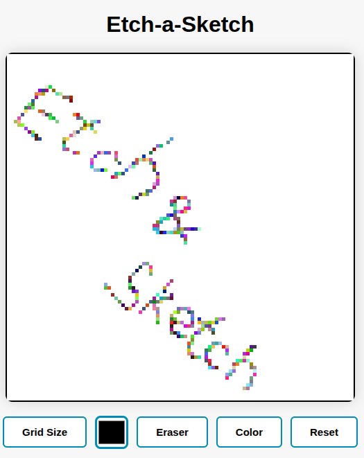

# 🎨 Etch-a-Sketch Project



**Etch-a-Sketch style drawing application** built using **HTML, CSS, and JavaScript**. Users can draw on a grid-based board, choose custom colors, enable rainbow mode, and use an eraser. Drawing is activated by clicking and holding the mouse.

---

## 🚀 Features

* Adjustable grid size (16–100)
* Click-and-drag drawing
* Rainbow mode (random colors)
* Standard color picker
* Eraser mode
* Clear board functionality
* Smooth and intuitive user interactions

---

## 📦 Installation

Follow these steps to run the project locally:

1. **Clone the repository**

```bash
git clone https://github.com/baranecp/etch-a-sketch.git
```

2. **Navigate to the project folder**

```bash
cd etch-a-sketch
```

3. **Open the project**
   Simply open the `index.html` file in your browser:

```bash
open index.html
```

Or double‑click it.

No build tools or dependencies required.

---

## 🧭 Usage

* Hover + click-and-drag to draw on the grid.
* Use the **color picker** to choose a custom drawing color.
* Toggle **rainbow mode** for random color strokes.
* Enable **eraser mode** to remove drawn colors.
* Press **Clear** to reset the board.
* Press **Resize** to choose a new grid size.

---

## 🤝 Contributing

Feel free to open issues or submit pull requests. Contributions are welcome!
